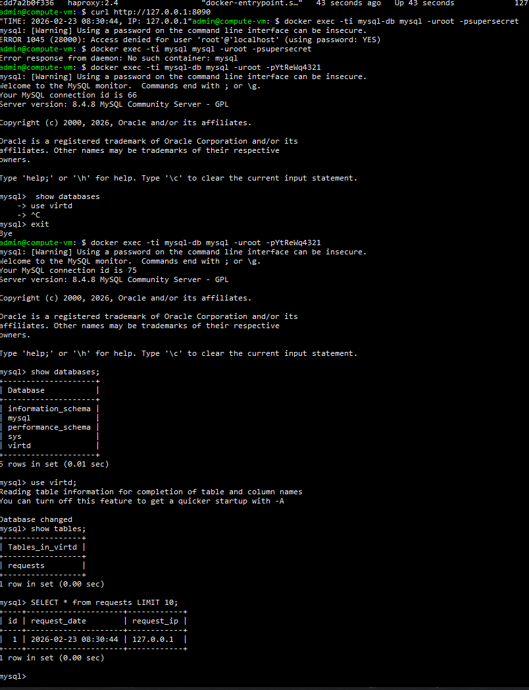
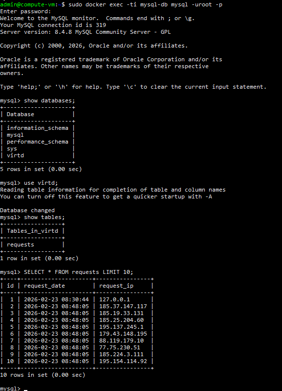
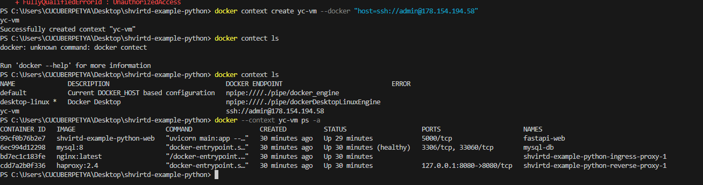
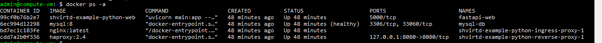
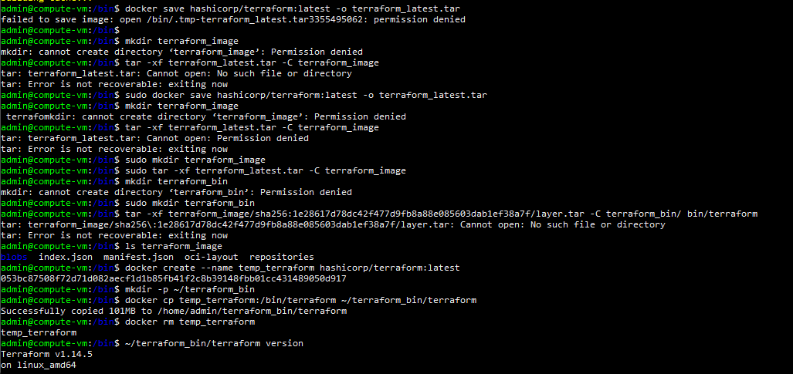

# Задача 2 (*)
[text](screen/vulnerabilities.csv)
[text](screen/vulnerabilities.csv)
---
# Задача 3

---
# Задача 4

[text](download_script.sh)
---

fork - https://github.com/ccyberpetya/shvirtd-example-python
---
## Bush-script
[text](screen/download_script.sh)
---

# Задача 6
!
---

---